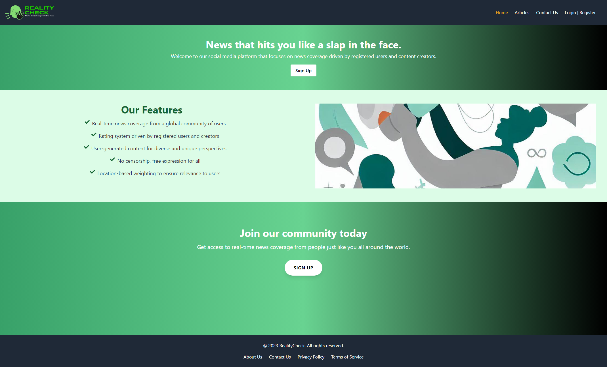

# Reality Check News

  
## Table of Contents

* [Description](#description)
* [Installation](#installation)
* [Usage](#usage)
* [Contribution](#contribution)
* [Testing](#testing)
* [Questions](#questions)
* [Licensing](#licensing)

## Description

This is a news application that allows users to browse articles and search for specific topics. Users can view trending articles, filter articles by category, and search for articles by keyword.

The app is built with React, Node.js, and GraphQL, and uses a MongoDB database to store articles. It is deployed on Heroku and is connected to a GraphQL API that queries the database.

Deployed Project: https://sleepy-brushlands-04075.herokuapp.com/
   
 

## Installation

You'll need  [Mongo](https://www.mongodb.com/),  [Express](https://www.npmjs.com/package/express),  [React](https://www.npmjs.com/package/react), [Node.js](https://nodejs.org/)

Then, npm run:
- "start": "node server/server.js",
- "develop": "concurrently \"cd server && npm run watch\" \"cd client && npm start\"",
- "install": "cd server && npm i && cd ../client && npm i",
- "seed": "cd server && npm run seed",
- "build": "cd client && npm run build",
- "watch:css": "cd client && npx tailwind -i ./src/index.css -o ./src/styles.css --watch"

## Usage

Navigate to Articles and perform a Search for article titles
Or Login/Register to access a User Profile to get a personalized news feed

## Contribution

Follow the "fork-and-pull" Git workflow.

  1. **Fork** the repo on GitHub
  2. **Clone** the project to your own machine
  3. **Commit** changes to your own branch
  4. **Push** your work back up to your fork
  5. Submit a **Pull request** so that we can review your changes

NOTE: Be sure to merge the latest from "upstream" before making a pull request!

## Testing
  
N/A

## The Team

- [decourtney](https://github.com/decourtney)
- [ash12486](https://github.com/ash12486)
- [Redisred663](https://github.com/Redisred663)

## Licensing

Code and Docs released under [MIT License](https://choosealicense.com/licenses/mit/).
